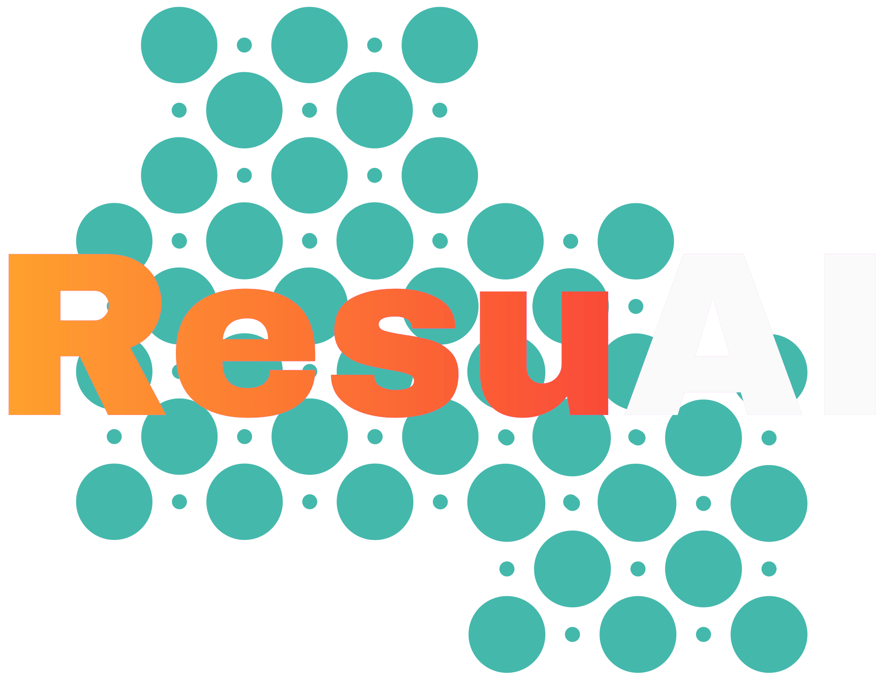

<div align="center">



# **ResuAI**

### *Your AI-Powered Career Companion*

**Create stunning resumes, optimize for ATS, generate portfolios, and ace interviews—all powered by advanced AI technology.**

<p>
  <a href="https://resuu-ai.vercel.app/" target="_blank">
    
  </a>
  <a href="#-getting-started">
    
  </a>
  <a href="docs/SECURITY.md">
    
  </a>
</p>

<p>
  
  
  
  
</p>

</div>

---

## 📋 Table of Contents

- [Introduction](#-introduction)
- [Key Features](#-key-features)
- [Tech Stack](#️-tech-stack)
- [Getting Started](#-getting-started)
- [Security](#-security)
- [Contributing](#-contributing)
- [License](#-license)
- [Contact](#-contact)

---

## 🎯 Introduction

**ResuAI** is an intelligent, modern platform designed to revolutionize your job application process. By leveraging the power of Generative AI, ResuAI helps you effortlessly create, refine, and showcase your professional story. Whether you're building a resume from scratch, optimizing it for Applicant Tracking Systems (ATS), or generating a stunning portfolio website, ResuAI is your personal career-building assistant.

### Why Choose ResuAI?

- ✅ **AI-Powered Intelligence** - Leverages Google's Gemini AI for smart suggestions
- ✅ **ATS Optimization** - Ensures your resume passes automated screening systems
- ✅ **All-in-One Platform** - Resume builder, analyzer, portfolio generator, and more
- ✅ **Enterprise-Grade Security** - Built with security best practices and comprehensive protection
- ✅ **Modern & Responsive** - Beautiful UI that works seamlessly on all devices
- ✅ **Open Source** - Transparent, community-driven development

<br />

<div align="center">
<a href="https://resuu-ai.vercel.app">

</a>

### [🚀 **Try ResuAI Live Demo**](https://resuu-ai.vercel.app)

</div>

<br />

---

## 🚀 Key Features

Our comprehensive suite of AI-powered tools gives you a competitive edge in the job market:

<table>
  <tr>
    <td width="50%" valign="top">
      <h3>📄 AI Resume Editor</h3>
      <p><strong>Smart Resume Creation & Optimization</strong></p>
      <ul>
        <li>AI-powered content refinement and phrasing improvements</li>
        <li>Multiple ATS-friendly professional templates</li>
        <li>Real-time preview and editing</li>
        <li>One-click PDF generation</li>
      </ul>
    </td>
    <td width="50%" valign="top">
      <h3>🔍 AI Resume Analyzer</h3>
      <p><strong>Intelligent ATS Optimization</strong></p>
      <ul>
        <li>Instant data-driven feedback and scoring</li>
        <li>Job description compatibility analysis</li>
        <li>Keyword optimization suggestions</li>
        <li>ATS compatibility scoring</li>
      </ul>
    </td>
  </tr>
  <tr>
    <td width="50%" valign="top">
      <h3>🌐 AI Portfolio Generator</h3>
      <p><strong>Professional Portfolio Websites</strong></p>
      <ul>
        <li>Transform resume to responsive portfolio in seconds</li>
        <li>Multiple modern design templates</li>
        <li>Unique shareable links</li>
        <li>Fully customizable with live preview</li>
      </ul>
    </td>
    <td width="50%" valign="top">
      <h3>✍️ AI Cover Letter Writer</h3>
      <p><strong>Personalized Cover Letters</strong></p>
      <ul>
        <li>AI-generated personalized content</li>
        <li>Tailored to specific job descriptions</li>
        <li>Professional formatting and tone</li>
        <li>Multiple revision options</li>
      </ul>
    </td>
  </tr>
  <tr>
    <td width="50%" valign="top">
      <h3>🧠 AI Interview Preparation</h3>
      <p><strong>Mock Interviews & Practice</strong></p>
      <ul>
        <li>AI-powered interview coach</li>
        <li>Industry-specific question banks</li>
        <li>Timed aptitude tests</li>
        <li>Performance analytics and feedback</li>
      </ul>
    </td>
    <td width="50%" valign="top">
      <h3>👤 Centralized Profile Management</h3>
      <p><strong>Single Source of Truth</strong></p>
      <ul>
        <li>Unified professional profile</li>
        <li>Consistent data across all tools</li>
        <li>Easy profile updates</li>
        <li>Secure cloud storage</li>
      </ul>
    </td>
  </tr>
</table>

---

## 🛠️ Tech Stack

ResuAI leverages cutting-edge technologies for optimal performance and security:

<table>
  <tr>
    <td align="center" width="25%">
      <br />
      <sub><b>React Framework</b></sub>
    </td>
    <td align="center" width="25%">
      <br />
      <sub><b>Type Safety</b></sub>
    </td>
    <td align="center" width="25%">
      <br />
      <sub><b>Styling</b></sub>
    </td>
    <td align="center" width="25%">
      <br />
      <sub><b>UI Components</b></sub>
    </td>
  </tr>
  <tr>
    <td align="center" width="25%">
      <br />
      <sub><b>AI Engine</b></sub>
    </td>
    <td align="center" width="25%">
      <br />
      <sub><b>Auth & Database</b></sub>
    </td>
    <td align="center" width="25%">
      <br />
      <sub><b>Hosting</b></sub>
    </td>
    <td align="center" width="25%">
      <br />
      <sub><b>PDF Generation</b></sub>
    </td>
  </tr>
</table>

### Core Technologies

- **Frontend**: Next.js 15, React 19, TypeScript
- **Styling**: Tailwind CSS, ShadCN UI, Radix UI
- **AI/ML**: Google Generative AI (Gemini), Firebase Genkit
- **Backend**: Next.js Server Actions, Node.js
- **Database**: Cloud Firestore (NoSQL)
- **Authentication**: Firebase Authentication
- **Storage**: Firebase Storage, ImageBB
- **Deployment**: Vercel (Frontend), Firebase Cloud Functions
- **PDF Generation**: Playwright, Puppeteer

---

## 🏁 Getting Started

Get ResuAI running locally in minutes:

### Prerequisites

Ensure you have the following installed:

- **Node.js** v18.0.0 or higher ([Download](https://nodejs.org/))
- **npm** v9.0.0 or higher (comes with Node.js)
- **Git** ([Download](https://git-scm.com/))

### Quick Start

#### 1. Clone the Repository

```bash
git clone https://github.com/MrTG1B/ResuAI.git
cd ResuAI
```

#### 2. Install Dependencies

```bash
npm install
```

#### 3. Configure Environment Variables

Create a `.env` file in the root directory:

```bash
cp .env.example .env
```

Edit `.env` and add your credentials:

```env
# Firebase Configuration (Required)
NEXT_PUBLIC_FIREBASE_API_KEY=your_firebase_api_key
NEXT_PUBLIC_FIREBASE_AUTH_DOMAIN=your_project.firebaseapp.com
NEXT_PUBLIC_FIREBASE_PROJECT_ID=your_project_id
NEXT_PUBLIC_FIREBASE_STORAGE_BUCKET=your_project.appspot.com
NEXT_PUBLIC_FIREBASE_MESSAGING_SENDER_ID=your_sender_id
NEXT_PUBLIC_FIREBASE_APP_ID=your_app_id

# Google AI API Key (Required)
NEXT_PUBLIC_GEMINI_API_KEY=your_gemini_api_key

# Optional: Google Cloud Vertex AI
NEXT_PUBLIC_GOOGLE_CLOUD_PROJECT_ID=your_gcp_project_id
NEXT_PUBLIC_VERTEX_AI_LOCATION=us-central1

# Image Upload Service
NEXT_PUBLIC_IMGBB_API_KEY=your_imgbb_api_key
```

<details>
<summary><b>📖 Where to Get API Keys</b></summary>

- **Firebase**: [Create a Firebase project](https://console.firebase.google.com/)
- **Google AI (Gemini)**: [Get API key from Google AI Studio](https://makersuite.google.com/app/apikey)
- **ImageBB**: [Register at ImageBB](https://imgbb.com/signup) and get API key

</details>

#### 4. Run Development Server

```bash
npm run dev
```

Open [http://localhost:3000](http://localhost:3000) in your browser. 🎉

### Build for Production

```bash
npm run build
npm start
```

---

## 🔒 Security

ResuAI is built with **enterprise-grade security** as a top priority:

### Security Features

✅ **HTTP Security Headers** - CSP, HSTS, X-Frame-Options, etc.  
✅ **Rate Limiting** - Protection against DoS and API abuse  
✅ **Input Validation** - Comprehensive sanitization and validation  
✅ **Secure Authentication** - Firebase Auth with best practices  
✅ **Database Security** - Firestore rules with owner-based access control  
✅ **Environment Protection** - Secrets management with `.env` files  
✅ **XSS Prevention** - HTML sanitization and CSP policies  
✅ **Error Handling** - Secure error messages without information disclosure  

### Security Documentation

- 📖 [**Security Guidelines**](docs/SECURITY.md) - Comprehensive security measures and best practices
- 🔧 [**Security Fixes**](docs/SECURITY_FIXES.md) - Detailed security improvements implemented
- 📊 [**Security Summary**](docs/SECURITY_FIXES_SUMMARY.md) - Quick overview of security enhancements

### Reporting Security Issues

Found a security vulnerability? Please **do not** create a public issue.

📧 **Email**: [Report Security Issue](mailto:tirthankardasgupta913913@gmail.com)

We take security seriously and will respond within 48 hours.

---

## 🤝 Contributing

We welcome contributions from the community! Whether it's bug fixes, new features, or documentation improvements, your help is appreciated.

### How to Contribute

1. **Fork** the repository
2. **Clone** your fork: `git clone https://github.com/your-username/ResuAI.git`
3. **Create** a feature branch: `git checkout -b feature/amazing-feature`
4. **Make** your changes and commit: `git commit -m 'Add amazing feature'`
5. **Push** to your fork: `git push origin feature/amazing-feature`
6. **Open** a Pull Request

### Contribution Guidelines

- ✅ Follow existing code style and conventions
- ✅ Write clear commit messages
- ✅ Add tests for new features
- ✅ Update documentation as needed
- ✅ Ensure all tests pass before submitting PR

### Development Workflow

```bash
# Install dependencies
npm install

# Run development server
npm run dev

# Run type checking
npm run type-check

# Build for production
npm run build
```

---

## 📜 License

This project is licensed under the **MIT License** - see the [LICENSE](LICENSE) file for details.

```
MIT License - Copyright (c) 2025 Tirthankar Dasgupta
```

---

## 📬 Contact

<div align="center">

**Tirthankar Dasgupta**

[](https://github.com/MrTG1B)
[](https://www.linkedin.com/in/tirthankardasgupta)
[](mailto:tirthankardasgupta913913@gmail.com)

**Project Link**: [https://github.com/MrTG1B/ResuAI](https://github.com/MrTG1B/ResuAI)

**Live Demo**: [https://resuu-ai.vercel.app](https://resuu-ai.vercel.app)

</div>

---

<div align="center">

### ⭐ Star this repository if you find it helpful!

**Made with ❤️ by [Tirthankar Dasgupta](https://github.com/MrTG1B)**

</div>